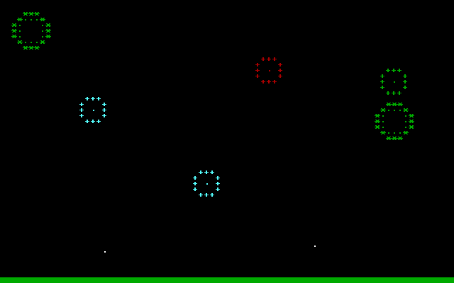

## Misc Directory  
Various things I puttered with. Here is a description by file name.  

### Directories  

**/ARCHIVE**  
A collection of the assignments and other programs I created in high school between 1992 and 1997. They're here because, amazingly, I still had them on disk! It's kind of neat to see what we were doing back then. This was grade 10 and 11. I didn't take the grade 12 and 13 classes, where they worked with Pascal, because I was interested in other things at the time. Funny enough, I took grade 13 chemistry two semesters in a row, because I enjoyed it so much the first time. And wouldn't you know it, that left me one English credit short of graduating, so I had to take grade 13 English in summer school! Whoops! Man, that teacher sure hated the assignments I handed in typed on my Underwood manual typewriter (on green paper with white "White-Out" corrections lol...). She wouldn't accept hand written essays, but we didn't have a computer at home and we weren't able to use the computers at the school in the summer, so that was the best I could do at the time. Ah my life, so full of *weird* was it...  

**/COMSCR0**  
Tools and code that I am creating as the basis for my text mode games. Generally these will take advantage of the full 80x50 character resolution offered by QBasic.  

**/COMSCR7**  
Tools and code that I am creating as the basis for my text mode games that can use the graphical enhancements offered by Screen Mode 7. It's designed to enhance the chunky 40x25 ASCII characters using 16 color sprites that are loaded from pain text CSV files.  

**/RUNMAN**  
Testing sprite animation using a 4 frame 8x8 running man. 

**/SPRITE1**
A demonstration on how to create and use a sprite that is loaded from a comma separated data file.

### Files  

**ASCCOLR.BAS**  
Working with character mode only in Screen 0, I wanted to combine the integer values for ASCII characters with the desired colour values into a single variable (for use in arrays and CSV files for ASCII art images). This is a quick test of the thought process.

**BNCYCRC.BAS**  
A bouncing circle, animated by drawing red circles from left to right and drawing over them with black circles (very inefficient). Nothing serious, just playing with the draw functions.

**BNCYCRC2.BAS**  
A bouncy circle that makes use of screen memory page flipping to smooth out the animation.

**CLRS.BAS**  
Displays the 16 colours used by QBasic in screen modes 0 and 7.  

**FWRKS1.BAS**  
I felt like making some character graphics fireworks, so I made this. Then I got tired, but I'd like to make a better version some other time.

**FWRKS2.BAS**  
An attempt at using TIMER to make multiple ASCII fireworks at the same time. Buggy, because of constant, frustrating, distractions when creating this... Perhaps I will come back to it later.

**FWRKS3.BAS**  
**This is what I wanted!!** Firing and exploding multiple ASCII fireworks independently, while playing explosion sounds and _trying_ to avoid over-writing the sparks.  
  

**GAMETIME.BAS**  
A clock and calendar for use in a game. It keeps track of the time of day and the day of the season, where there are four seasons in a year.  

**MOVE#.BAS**  
Playing with the movement of an object and redrawing the screen.

**SELECT.BAS**  
Testing a way to highlight a section of text and show some data related to it. Reads and reprints the characters from/to the screen directly.

**TARRSZ.BAS**  
A program for testing the memory usage of 1 and 2 dimensional arrays of different variable types.  

**THEBEST.BAS**  
Flickering "stars" I made to test the speed of QBasic on my Compaq Deskpro 4000 running DOS 7 (Windows 98SE) on a Pentium 233MMX. This program runs so fast on the real Pentium CPU that I can't quite match it using DOSBox using the 2GHz Intel Celeron 3450 in my laptop, even with it set to 200,000 cycles per second. Normally I run DOSBox at 5,000 cycles, so that's quite the difference speed and it still comes up short.

**TRAPS.BAS**  
Using the ON KEY function to trap user input and put it to good use making the world a happier place!

**WRPARRY.BAS**  
I was having a hard time printing out the values of an array starting at an arbitrary point, where I printed X before and X after the starting point. So I made this program to break the problem down to its essence. QBasic's array indexes starting at 1 rather 0 makes this a little harder than in other languages. But I'm no math genius, so perhaps a PEBKAC. :)  
