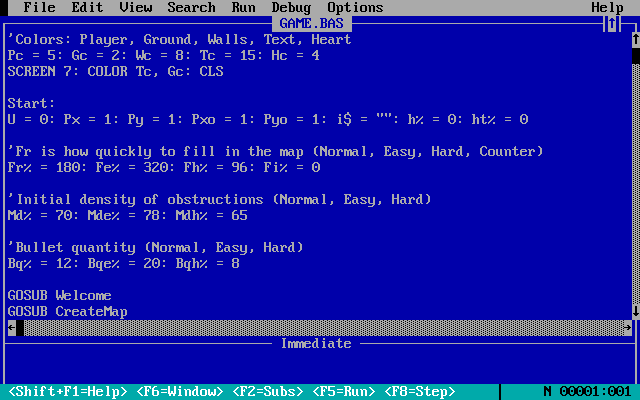
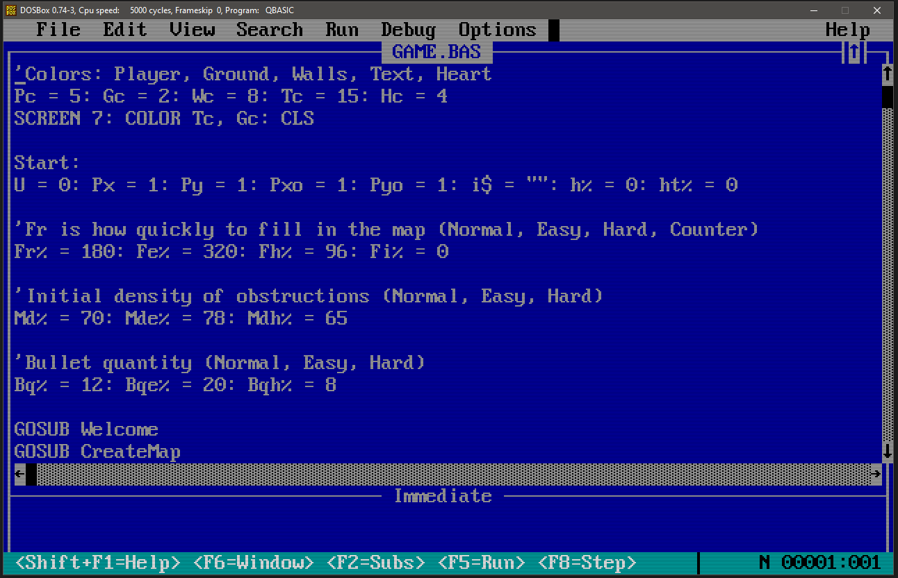

# My QBasic Adventures

I enjoy simplicity. Of all the ways I have programmed since the late 1980s, Microsoft QBasic 1.1 is my favourite. I enjoy the inherent limitations and delightful end user experience of the IDE. Truly, it's a system that achieves its goals in a comprehensive, compact, and efficient manner.  

As far as hobbies go, programming is inexpensive and accessible, but it isn't always fun to wade through the complexities of modern systems. Sometimes it's nice to just hop on the computer and complete something functional in a sitting, where the beauty is in the process rather than the graphical fidelity. So that's where my QBasic endeavours land, somewhere between puzzling through a game of Sudoku and aping a Bob Ross painting on a lazy Sunday afternoon....  

## Project Overview

- Intentionally only using the Micosoft QBasic 1.1 IDE, because this is a nostalgia driven retro computing project!
- Primarily making ASCII character and simple graphical games.
- Designed to run well in DOSBox at 5000 cycles. This is probably close to a real Intel 386DX/33 CPU.
- After much testing, I decided that I like the look of the tv2x DOSBox filter when using my 24" 1080p LCD desktop monitor (BenQ GW2470). It doesn't look exactly the same as the 15" CRT I used in the 1990s, but I think it looks better than not using a screen filter at 2x resolution (which really is required on this size of screen, else the window is just too small). So that's the <a href="#images">"look and feel"</a> I am seeing on my end when creating/using these programs.  

## Project Files

Each sub directory has it own README file that describes the files within in greater detail. I figured that was handy way to organize things... :)

**/GAMES**  
- **GAME1:** Collect all the hearts and escape the caves before the tunnels collapse and you run out of bombs. This game is effectively my own general purpose character graphics "game engine", a foundation I can build upon in future projects.

**/BENCHES**  
- My attempt to help people run QBasic 1.1 at the same speed on different hardware, real and emulated.

**/MISC**  
- Various BASIC programs that I created for testing/learning/fun.
- Includes an archive of some of the stuff I did in school in the early 1990s.

**/NOTES**
- Information and observations related to my modern use of QBasic.

## Disclaimer

The only real "retro PC" I have to test these programs with is my Pentium 233MMX based Compaq Deskpro 4000, which is actually *too fast* for QBasic. Consequently, I am uncertain how well these programs will run using real 386 and 486 computers. That said, I have done a considerable amount of testing using PCem and I am confident my QBasic software will perform acceptably on 386 and slower 486 compatible PCs.

If you have some old machines and you feel like testing some things for me, please see the [BENCHES](/BENCHES) directory. Your contributions, both documentation and benchmark programs, are welcome!

## DOSBox Config

These are the changes I made to the default dosbox-0.74-3.conf file.  

[sdl] 
fullresolution=desktop 
windowresolution=1280x800 
output=opengl 

[render] 
scaler=tv2x forced 

[cpu] 
core=normal 
cputype=386 
cycles=5000 

[autoexec] 
mount C /PATH/TO/MY/DOS/STUFF/ 
SET PATH=Z:\;C:\EXE; 
C: 

## Copyright

Creative Commons CC0 1.0 Universal. See the LICENSE file for more details.

## Images
Here are some screen shots.  

  

