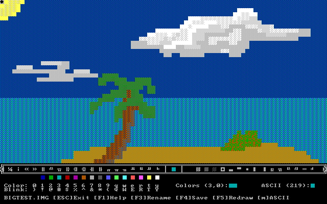
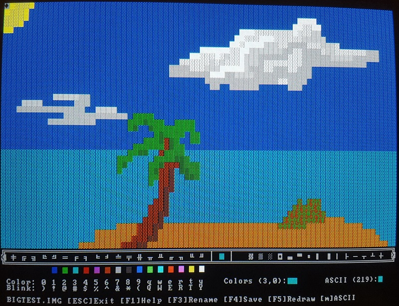

# My QBasic Adventures

I enjoy simplicity. Of all the ways I have programmed since the late 1980s, Microsoft QBasic 1.1 is my favourite. I enjoy the inherent limitations and delightful end user experience of the IDE. Truly, it's a system that achieves its goals in a comprehensive, compact, and efficient manner.  

As far as hobbies go, programming is inexpensive and accessible, because you can do it on anything from a $5 Raspberry Pi Zero to any personal computer you happen to find laying around. There are thousands of languages and an unlimited supply of problems to solve! That said, the idea of a hobby is to spend your time doing something that you find interesting and enjoyable. When it comes to programming projects, I have learned that, for me, the joy comes from the system design and implementation processes rather than the accolades from making "The Great Canadian Computer Game!" or whatever; I like "making stuff", but I don't enjoy when it requires spending thousands of hours of concentrated effort, locked away from the world at the expense of other aspects of my life.  

Enter QBasic, a nostalgic programming environment from my youth that doesn't ask too much of my time, yet is still able to provide me with enough complexity and flexibility to be entertaining. And thanks to DOSBox, QBasic works exactly the same on my laptop as it does on my desktop, which means I can have the same experience anywhere I feel comfortable at the time; sometimes I just don't feel like sitting at my desk! I really like this system - it's not perfect and nothing I make with it will be relevant to 99.99987% of humanity, but it makes me happy and that's what hobbies are all about.

Incidentally, QBasic actually _does_ perform as expected on a Raspberry Pi Zero, running in DOSBox under Raspbian Lite!  

## Project Overview

- Unless otherwise noted, all of my programs are designed to be run inside the QBasic 1.1 IDE using DOSBox 0.74 at 5000 cycles. 
- I am emulating the experience of programming on a 386/DX 33MHz PC from the early 1990s, in a manner that is convenient and consistent for myself and anyone else who happens to come by.
- Primarily making ASCII character games, tools, and misc programs.

## Project Files

Each sub directory has it own README file that describes the files within in greater detail. I figured that was handy way to organize things... :)

**[/GAMES](/GAMES)**  
- **GAME1:** A simple character graphics game where you must collect all the hearts before the tunnels collapse and you run out of bombs.  

**[/TOOLS](/TOOLS)**  
- **IMAGEMAKER:** An ASCII art creation for QBasic that I created for use primarly with the Screen 0 80x50 text mode. It's designed to make images upto 80 characters wide and 40 characters tall.  
- **/MENUMKR/MENUMKR.BAS:**  This is a function I made to include in other Screen 0, 80x50 based software. It reads menu data from text files and displays the menu to the user.  

**[/BENCHES](/BENCHES)**  
- My attempt to help people run QBasic 1.1 consistently on different hardware, real and emulated. 

**[/MISC](/MISC)**  
- Various BASIC programs that I created for testing/learning/fun.
- Includes an archive of some of the stuff I did in school in 1991-1992.

**[/WIKI](/WIKI)**
- Information and observations related to my use of QBasic.  

**[/IMG](/IMG) and [/VID](/VID)**
- Pictures and videos of various programs, as well as information that is best displayed as an image.

## How To Use This Software

1. [Download](https://www.dosbox.com/download.php?main=1) and install DOSBox for your computer (Windows, Linux, MacOS).  
2. [Download](https://www.qbasic.net/en/qbasic-downloads/compiler/qbasic-interpreter.htm) QBasic 1.1, hosted by qbasic.net.  
3. Create a folder on your computer to be your fake "C drive" in DOSBox, such as in C:\MYDOS.  
4. Create the folder for for your DOS programs C:\MYDOS\EXE.  
5. Extract QBASIC.EXE and QBASIC.HLP to C:\MYDOS\EXE.  
6. Edit your DOSBox config file (see below).  
7. Download this repository (as a zip file or using Git) and put it into your C:\MYDOS folder.
8. Run DOSBox, cd into the directory of the program you're interested in and run it by typing: _qbasic /run filename_  

## DOSBox Config

These are the changes I made to the default dosbox-0.74-3.conf file.  

[sdl] 
fullresolution=desktop 
windowresolution=1280x800 
output=opengl 

[render] 
scaler=tv2x forced 

[cpu] 
core=normal 
cputype=386 
cycles=5000 

[autoexec] 
mount C /PATH/TO/MY/DOS/STUFF/ 
SET PATH=Z:\;C:\EXE; 
C:   

## Programming Style
As of October 2020, I have decided that I will do my best to stick the following guidelines to help make my programs easier to read.  

- Comments start with a single quote and space.  
- Indentation of 2 spaces highlight loops and conditional blocks.  
- Subroutine names, labels, and constants in PascalCase.  
- Arrays, custom data types, and loose long term variables (such as playerName) in camelCase.  
- Temporary variables, counters, and system related variables (like PKEY = INKEY$) in capital letters.  
- I will put related statements on the same line for speed, if it isn't a nightmare to read.  
- Programs will be divided into subs as much as possible for readability and memory optimization, but not at the expense of stack space.  
- I don't use LET or CALL.  
- I do use DIM blah AS blah for global variables.  

Initially when I got back into doing QBasic I was using two or three letter variable names for speed, but it turns out that unlike using BASIC on the Commodore 64, there is very little difference in QBasic 1.1 when using longer variable names. As such, the short variable names used in my newer programs are essentially temporary values, such as subroutine parameters, counters, or system related values, which should be fairly obvious (RS, CS = RowStart, ColumnStart). That said, if I find that I need to speed up a program (or save some memory - not sure if that matters with QBasic) by using shorter variable names, I will make a point of describing them in the comments.  

## Copyright

Creative Commons CC0 1.0 Universal. See the LICENSE file for more details.

## Images

After much testing, I decided that I like the look of the tv2x DOSBox filter when using my 24" 1080p LCD desktop monitor (BenQ GW2470). It doesn't look exactly the same as a real CRT monitor (I tested it on a 17" Dell cicra 2004), but the scan lines really bring out the . So that's the "look and feel"I am seeing on my end when creating/using these programs. That said, on my laptop I used the normal2x filter, because the scan lines don't scale properly on its 1366x768 LCD and the font is blurry without the normal2x filter.  

**Default QBasic 1.1 in DOSBox**  
  

**QBasic 1.1 in DOSBox with the TV scan line filter**  

Here is a comparison between a screenshot of my Image Maker program running on my desktop using the tv2x filter and a picture of it running in DOS 7 (Compaq Deskpro 4000 running Windows 98SE) on my 17" Dell CRT monitor. Even in person, the character graphics look better in DOSBox, because they lack the vertical lines/banding as seen on CRT. However, the lines/vertical banding do not appear on my 17" Dell LCD monitor when I plug it into the DOS 7 system; The 17" LCD in real DOS looks pretty much identical to DOSBox on my laptop, save for a slight difference in screen ratio.  

**ASCII Image Maker (DOSBox)**  

**ASCII Image Maker (Dell 17" SVGA CRT DOS7)**  

