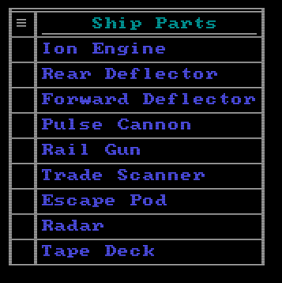

# Tools

Here are the various BASIC programs that I made to support the creation of other programs.  

## Image Maker
**/IMGMAKER/IMGMAKER.BAS**  
An ASCII art creation program that I made by converting and upgrading my simple sprite editor. It saves its images as plain text in CSV format files. The data format is simple: 731255 = (7) (31) (255) = (BG Color) (FG Color) (ASCII Code). I decided to use plain text files primarily because they work better with Git, but also because disk storage space isn't a problem for files of this size (25KB max) in today's world. Images can be as small as 4x4 characters and as large as 80x40 characters. There are several example images in the the IMGMAKER directory.  

  

## Menu Maker
**/MENUMKR/MENUMKR.BAS**  
 This is a function I made to include in other Screen 0, 80x50 based software. It reads menu data from text files, displays the menu to the user on the screen, waits for their selection, and returns the number of entry selected. Menus can be positioned anywhere on the screen where they will fit without overflowing the sides or bottom of the screen. Combined with custom user input actions, the system can be extended to do things like showing multiple pages of an inventory or examining the details of an item, etc.  

  