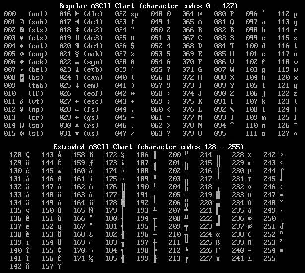
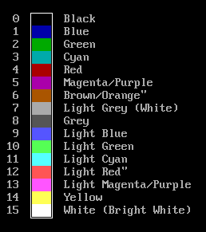

## ASCII Characters
Here are the characters as they are seen in QBasic, as well as their code numbers.  
  

## Text Colors
A simple refernce of the 16 colors available in QBasic Screen Mode 0.  

